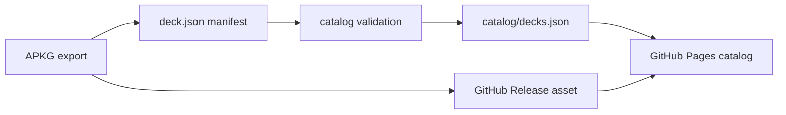

<div align="center">

# DeckHub

**GitHub-native Anki deck archive for certification and language study**

[덱 제출](https://github.com/Enceladus-X/deckhub/issues/new?template=deck_submission.yml)
· [릴리즈](https://github.com/Enceladus-X/deckhub/releases)
· [카탈로그 데이터](./catalog/decks.json)
· [운영 설계](./docs/architecture.md)

</div>

DeckHub는 APKG 파일을 GitHub Release에 보관하고, 작은 JSON manifest로 덱의
검색 정보, 버전, SHA256, 세부 범위, 노트 유형 정보를 관리하는 Anki 덱 공유
아카이브입니다.

처음부터 서버를 크게 띄우지 않습니다. 레포 자체를 신뢰 가능한 공유 페이지로 만들고,
GitHub Actions가 manifest를 검증한 뒤 정적 카탈로그와 GitHub Pages 화면을 생성합니다.
트래픽이나 비공개 배포가 필요해지는 시점에만 S3, CloudFront, Lambda 경로를 붙입니다.

## Current Catalog

아직 공개 덱은 등록되어 있지 않습니다.

| Metric | Count |
| --- | ---: |
| Decks | 0 |
| Cards | 0 |
| Split downloads | 0 |

덱이 추가되면 `decks/**/deck.json`에서 생성된 [`catalog/decks.json`](./catalog/decks.json)에
자동 반영됩니다.

## How It Works



## Repository Layout

| Path | Purpose |
| --- | --- |
| [`decks/`](./decks) | Human-authored deck manifests. |
| [`catalog/`](./catalog) | Generated catalog JSON consumed by readers and tooling. |
| [`frontend/`](./frontend) | Static Next.js catalog UI for GitHub Pages or any static host. |
| [`backend/`](./backend) | Optional Lambda API path for signed downloads later. |
| [`infrastructure/`](./infrastructure) | Optional AWS SAM stack for S3, CloudFront, API Gateway, Lambda. |
| [`scripts/`](./scripts) | Catalog generation and bootstrap scripts. |
| [`.github/`](./.github) | Issue templates, PR checklist, catalog validation workflow. |

## Add a Deck

1. Export an Anki `.apkg` file.
2. Attach the APKG to a GitHub Release.
3. Compute SHA256:

   ```powershell
   Get-FileHash .\deck.apkg -Algorithm SHA256
   ```

4. Create a manifest:

   ```powershell
   npm run deck:new -- language hsk-vocabulary
   ```

5. Edit `decks/<category>/<slug>/deck.json`.
6. Rebuild and validate:

   ```powershell
   npm run catalog:build
   npm run catalog:check
   npm run frontend:build
   ```

Detailed guide: [`docs/submit-deck.md`](./docs/submit-deck.md)

## Manifest Model

Each deck can include split segments so one large deck can still be useful in
smaller pieces:

```json
{
  "slug": "hsk-vocabulary",
  "title": "HSK 1~3급 600단어 예문",
  "category": "language",
  "exam": {
    "name": "HSK",
    "scope": ["1급", "2급", "3급"]
  },
  "versions": [
    {
      "version": "2026.06",
      "apkg": {
        "assetName": "hsk-vocabulary.apkg",
        "downloadUrl": "https://github.com/Enceladus-X/deckhub/releases/download/hsk-v2026.06/hsk-vocabulary.apkg",
        "sha256": "64-character-sha256-digest",
        "sizeBytes": 1200000
      },
      "segments": [
        {
          "id": "level-1",
          "label": "1급",
          "cards": 150
        }
      ]
    }
  ]
}
```

Schema: [`decks/_schema/deck.schema.json`](./decks/_schema/deck.schema.json)

## Local Development

```powershell
npm run catalog:build
npm --prefix frontend install
npm run frontend:dev
```

Backend tests remain available for the optional AWS path:

```powershell
python -m venv backend/.venv
backend/.venv/Scripts/python.exe -m pip install -r backend/requirements-dev.txt
backend/.venv/Scripts/python.exe -m pytest backend
```

## Quality Gates

The catalog workflow checks:

- Generated catalog is up to date.
- Deck slugs and version IDs are unique.
- APKG SHA256 values are valid and not duplicated.
- APKG URLs, sizes, dates, stats, and split segment metadata are valid.
- The static frontend lints and builds.

## Optional AWS Deployment

The original serverless path remains in the repository for later production use:

- S3 private bucket for APKG files
- CloudFront OAC and signed URLs
- Lambda/API Gateway download token API
- DynamoDB if runtime writes are needed
- GitHub Actions OIDC deployment

See [`infrastructure/README.md`](./infrastructure/README.md) when this becomes necessary.
