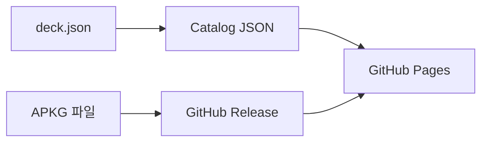

<div align="center">

# DeckHub

**직접 제작한 Anki 덱을 모아두는 공개 아카이브**

[덱 보러가기](https://enceladus-x.github.io/deckhub/)
· [다운로드 파일](https://github.com/Enceladus-X/deckhub/releases)
· [카탈로그 데이터](./catalog/decks.json)

</div>

DeckHub는 시험 공부용 Anki `.apkg` 덱을 정리해서 배포하는 개인 아카이브입니다.
방문자는 GitHub Pages에서 공개된 덱을 찾고, GitHub Releases에 올라간 APKG 파일을
다운로드할 수 있습니다.

현재는 누구나 업로드하는 플랫폼이 아닙니다. 덱은 저장소 관리자가 직접 만들고 검토한
것만 공개합니다. 이 방식 덕분에 로그인, 업로드 검수, 서버 운영 없이도 덱 파일과 버전
이력을 투명하게 관리할 수 있습니다.

## 바로가기

- 사이트: [https://enceladus-x.github.io/deckhub/](https://enceladus-x.github.io/deckhub/)
- APKG 파일: [GitHub Releases](https://github.com/Enceladus-X/deckhub/releases)
- 덱 목록 원본: [`catalog/decks.json`](./catalog/decks.json)

## 현재 공개 상태

현재 공개된 덱은 아래와 같습니다.

| 항목 | 수량 |
| --- | ---: |
| 덱 | 1 |
| 카드 | 600 |
| 분할 범위 | 3 |

| 덱 | 범위 | 카드 | 다운로드 |
| --- | --- | ---: | --- |
| HSK 1~3급 600단어 예문 | 1급 150, 2급 150, 3급 300 | 600 | [APKG](https://github.com/Enceladus-X/deckhub/releases/download/hsk-1-3-vocabulary-v2026.06/hsk-1-3-600-vocabulary-examples.apkg) |

새 덱이 공개되면 GitHub Pages의 카탈로그에도 자동으로 표시됩니다.

## 다운로드 방식



덱 파일 자체는 Git 저장소에 직접 넣지 않습니다. APKG는 GitHub Release에 보관하고,
`decks/<category>/<slug>/deck.json` manifest가 제목, 시험명, 버전, 카드 수, SHA256,
다운로드 링크를 관리합니다.

## 관리자를 위한 발행 절차

APKG를 분석해서 카드 수, 노트 수, 미디어 수, 태그별 범위를 확인합니다.

```powershell
python scripts/analyze-apkg.py .\deck.apkg
```

APKG를 Release에 올린 뒤 manifest를 생성합니다.

```powershell
npm run deck:link-release -- --category language --slug hsk-vocabulary --title "HSK Vocabulary" --summary "HSK vocabulary deck." --exam HSK --deck-version 2026.06 --release hsk-vocabulary-v2026.06 --asset hsk-vocabulary.apkg --sha256 <64-char-sha256> --cards 600 --notes 600 --media 0 --scope "Level 1,Level 2,Level 3"
```

카탈로그를 갱신하고 검증합니다.

```powershell
npm run catalog:build
npm run catalog:check
npm run frontend:build
```

`main`에 푸시되면 GitHub Actions가 GitHub Pages를 다시 배포합니다.

자세한 내용은 [`docs/publish-deck.md`](./docs/publish-deck.md)를 참고하세요.

## 프로젝트 구조

| 경로 | 설명 |
| --- | --- |
| [`decks/`](./decks) | 덱 manifest 원본 |
| [`catalog/`](./catalog) | 자동 생성되는 공개 카탈로그 JSON |
| [`frontend/`](./frontend) | GitHub Pages로 배포되는 정적 사이트 |
| [`scripts/`](./scripts) | APKG 분석, manifest 생성, catalog 빌드 도구 |
| [`.github/workflows/catalog.yml`](./.github/workflows/catalog.yml) | Pages 배포 workflow |

## 나중에 확장할 수 있는 것

현재는 정적 사이트와 GitHub Releases만 사용합니다. 트래픽이 커지거나 비공개 배포가
필요해지면 S3, CloudFront Signed URL, Lambda API를 다시 붙일 수 있도록 기존 AWS
인프라 폴더는 남겨두었습니다.
