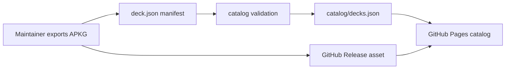

<div align="center">

# DeckHub

**Maintainer-curated Anki deck archive**

[GitHub Pages](https://enceladus-x.github.io/deckhub/)
· [Releases](https://github.com/Enceladus-X/deckhub/releases)
· [Catalog JSON](./catalog/decks.json)
· [Architecture](./docs/architecture.md)

</div>

DeckHub is a small, GitHub-native archive for Anki `.apkg` decks that are
created and maintained by the repository owner.

Public login and external deck submissions are intentionally disabled for now.
Users browse the catalog and download decks. The maintainer publishes new decks
by attaching APKG files to GitHub Releases and updating `decks/**/deck.json`
manifests.

This keeps the first version simple:

- No account system
- No moderation queue
- No runtime database
- No file storage bill
- Every deck update is a reviewable Git diff
- GitHub Actions rebuilds the static catalog

## Current Catalog

No public decks are registered yet.

| Metric | Count |
| --- | ---: |
| Decks | 0 |
| Cards | 0 |
| Split downloads | 0 |

When a manifest is added under `decks/**/deck.json`, the generated
[`catalog/decks.json`](./catalog/decks.json) and the GitHub Pages site are
updated by the catalog workflow.

## How It Works



## Repository Layout

| Path | Purpose |
| --- | --- |
| [`decks/`](./decks) | Maintainer-authored deck manifests. |
| [`catalog/`](./catalog) | Generated catalog JSON consumed by readers and tooling. |
| [`frontend/`](./frontend) | Static Next.js catalog UI for GitHub Pages or any static host. |
| [`backend/`](./backend) | Optional Lambda API path for signed downloads later. |
| [`infrastructure/`](./infrastructure) | Optional AWS SAM stack for S3, CloudFront, API Gateway, Lambda. |
| [`scripts/`](./scripts) | Catalog generation and bootstrap scripts. |
| [`.github/`](./.github) | Maintainer checklist and catalog validation workflow. |

## Publish a Deck

1. Export an Anki `.apkg` file.
2. Attach the APKG to a GitHub Release.
3. Compute SHA256:

   ```powershell
   Get-FileHash .\deck.apkg -Algorithm SHA256
   ```

4. Create a manifest:

   ```powershell
   npm run deck:new -- language hsk-vocabulary
   ```

5. Edit `decks/<category>/<slug>/deck.json`.
6. Rebuild and validate:

   ```powershell
   npm run catalog:build
   npm run catalog:check
   npm run frontend:build
   ```

Detailed guide: [`docs/publish-deck.md`](./docs/publish-deck.md)

## Manifest Model

Each deck can include split segments so one large APKG can still be useful in
smaller pieces:

```json
{
  "slug": "hsk-vocabulary",
  "title": "HSK 1-3 Vocabulary",
  "category": "language",
  "exam": {
    "name": "HSK",
    "scope": ["Level 1", "Level 2", "Level 3"]
  },
  "versions": [
    {
      "version": "2026.06",
      "apkg": {
        "assetName": "hsk-vocabulary.apkg",
        "downloadUrl": "https://github.com/Enceladus-X/deckhub/releases/download/hsk-v2026.06/hsk-vocabulary.apkg",
        "sha256": "64-character-sha256-digest",
        "sizeBytes": 1200000
      },
      "segments": [
        {
          "id": "level-1",
          "label": "Level 1",
          "cards": 150
        }
      ]
    }
  ]
}
```

Schema: [`decks/_schema/deck.schema.json`](./decks/_schema/deck.schema.json)

## Local Development

```powershell
npm run catalog:build
npm --prefix frontend install
npm run frontend:dev
```

Backend tests remain available for the optional AWS path:

```powershell
python -m venv backend/.venv
backend/.venv/Scripts/python.exe -m pip install -r backend/requirements-dev.txt
backend/.venv/Scripts/python.exe -m pytest backend
```

## Quality Gates

The catalog workflow checks:

- Generated catalog is up to date.
- Deck slugs and version IDs are unique.
- APKG SHA256 values are valid and not duplicated.
- APKG URLs, sizes, dates, stats, and split segment metadata are valid.
- The static frontend lints and builds.

## Optional AWS Deployment

The original serverless path remains in the repository for later production use:

- S3 private bucket for APKG files
- CloudFront OAC and signed URLs
- Lambda/API Gateway download token API
- DynamoDB if runtime writes are needed
- GitHub Actions OIDC deployment

See [`infrastructure/README.md`](./infrastructure/README.md) when this becomes necessary.
