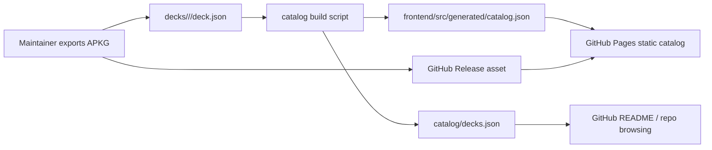

# DeckHub Architecture

DeckHub now starts as a GitHub-native archive:

## Why this direction

- No server is needed while the archive is small.
- APKG files do not pollute Git history.
- Every deck change is reviewable as a small manifest diff.
- External deck submissions stay disabled until the archive has enough operational
  demand to justify moderation, auth, and abuse controls.
- GitHub Actions can block duplicate SHA256 hashes, invalid URLs, missing stats,
  and malformed split segments.
- The existing AWS serverless stack can still become a production download layer
  later if traffic or private distribution requires it.

## Source of Truth

- Deck metadata: `decks/**/deck.json`
- Generated catalog: `catalog/decks.json`
- Frontend catalog: `frontend/src/generated/catalog.json`
- Large APKG files: GitHub Releases
- Publish workflow: maintainer commits and pull requests

## Later AWS Path

When GitHub Releases are not enough, keep the same manifest model and replace
`apkg.downloadUrl` with a backend-generated signed URL flow:

- S3 private bucket for APKG files
- CloudFront OAC and signed URLs
- Lambda/API Gateway for download tokens
- DynamoDB only if the catalog needs runtime writes
